# Graph Results

이 파일은 테스트 결과 확인용 그래프를 한 곳에 모아둔 문서입니다.

## Light 100-step Train/Validation Loss

- 원본 이미지: `figures/light_train_val_loss.png`
- 결과 JSON: `figures/light_train_val_loss.json`
- 요약: train loss는 7.8385에서 7.0178로, validation loss는 7.7681에서 7.0063으로 감소했습니다.

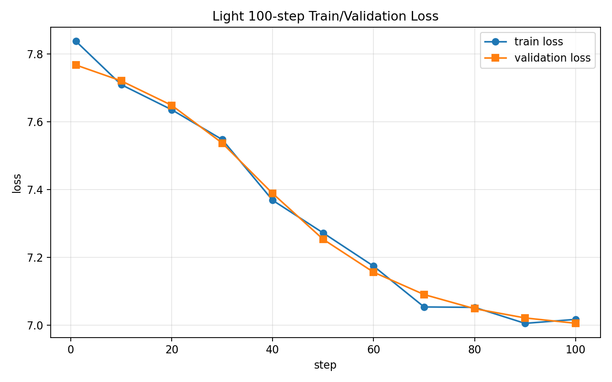

## Light Generation Token Frequency

- 원본 이미지: `figures/light_generation_token_freq.png`
- 결과 JSON: `figures/light_generation_smoke.json`
- 요약: 100-step 학습 후 greedy generation에서 token id 267이 30회 반복 생성되었습니다.

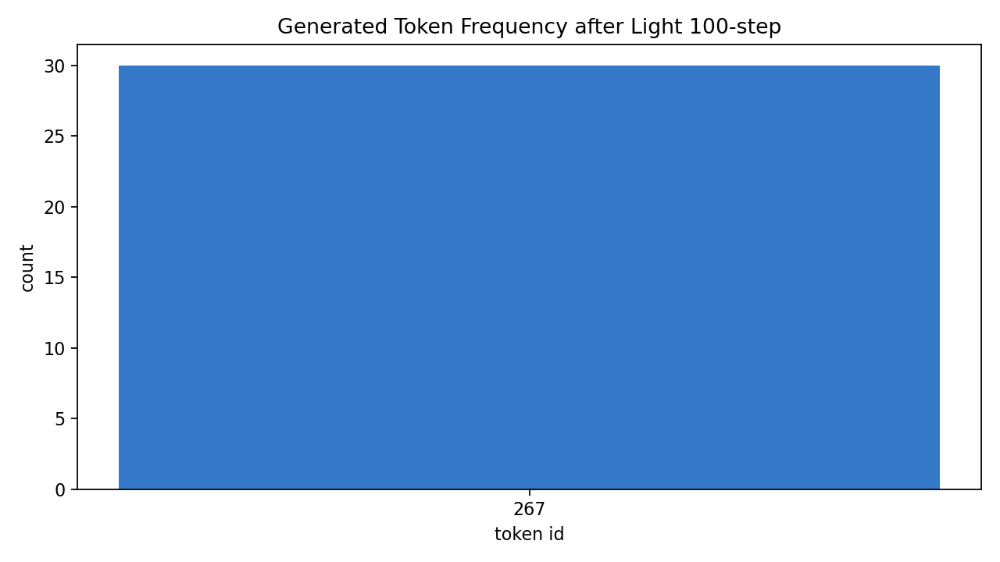

## Checkpoint Smoke Train Loss

- 원본 이미지: `figures/light_checkpoint_loss.png`
- 결과 JSON: `figures/light_checkpoint_smoke.json`
- 요약: 20-step 학습 후 checkpoint 저장/복원에서 loss와 parameter가 동일하게 복원되었습니다.

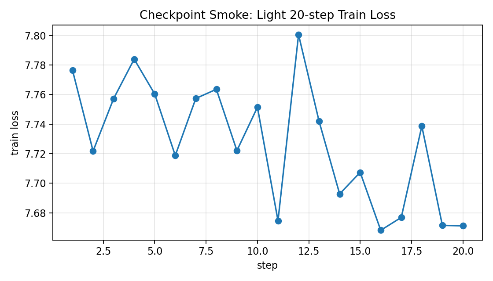

## Basic BPE Training Time

- 원본 이미지: `figures/basic_bpe_time.png`
- 결과 JSON: `figures/basic_bpe_time.json`
- 요약: 전체 사전 학습 train corpus 1,379,486자에서 `vocab_size=3000` BPE 학습에 약 9.276분이 걸렸습니다.

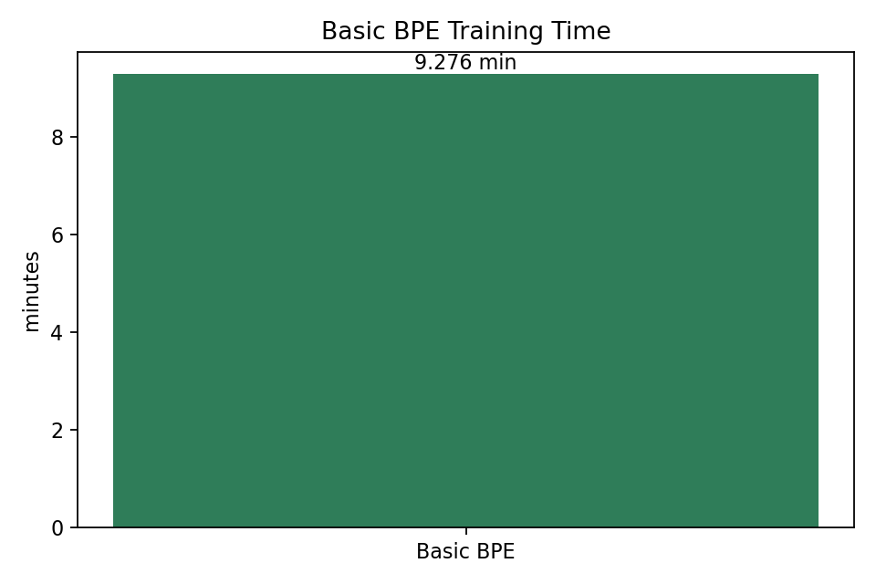

## Basic Batch Smoke Shapes

- 원본 이미지: `figures/basic_batch_shapes.png`
- 결과 JSON: `figures/basic_batch_smoke.json`
- 요약: Basic tokenizer와 `context_length=128`, `batch_size=4` 설정에서 input/target batch shape가 모두 `(4, 128)`로 생성되었습니다.

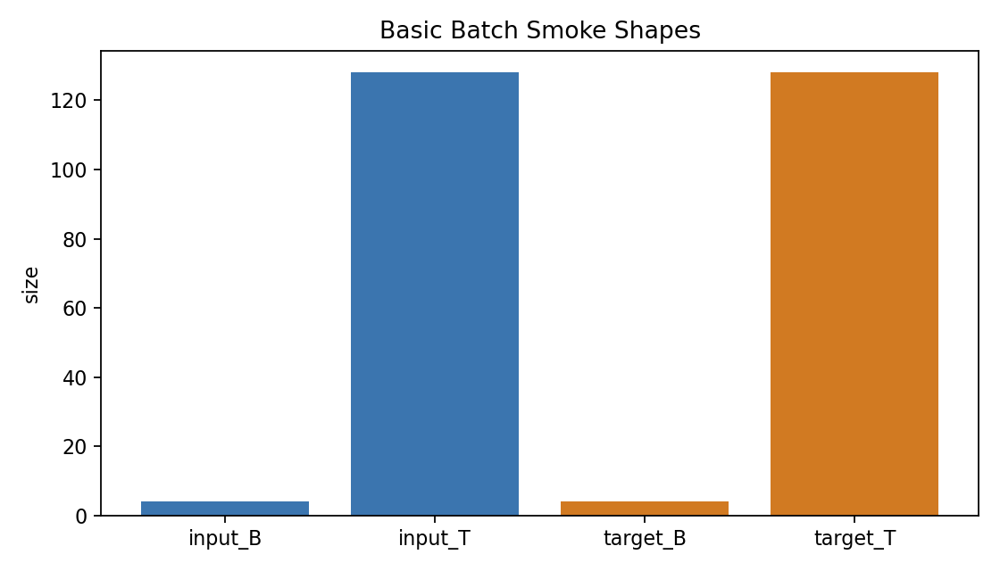

## Basic 50-step Train/Validation Loss

- 원본 이미지: `figures/basic_train_val_loss.png`
- 결과 JSON: `figures/basic_train_val_loss.json`
- 요약: Basic 설정에서 train loss는 8.1775에서 7.5693으로, validation loss는 8.1748에서 7.5192로 감소했습니다.

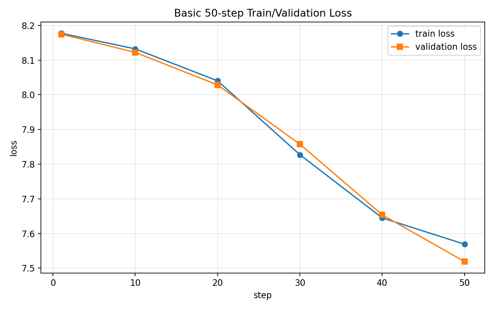

## Basic Generation Token Frequency

- 원본 이미지: `figures/basic_generation_token_freq.png`
- 결과 JSON: `figures/basic_generation_smoke.json`
- 요약: 50-step 학습 후 greedy generation에서 token id 272 (`는`)가 20회 반복 생성되었습니다.

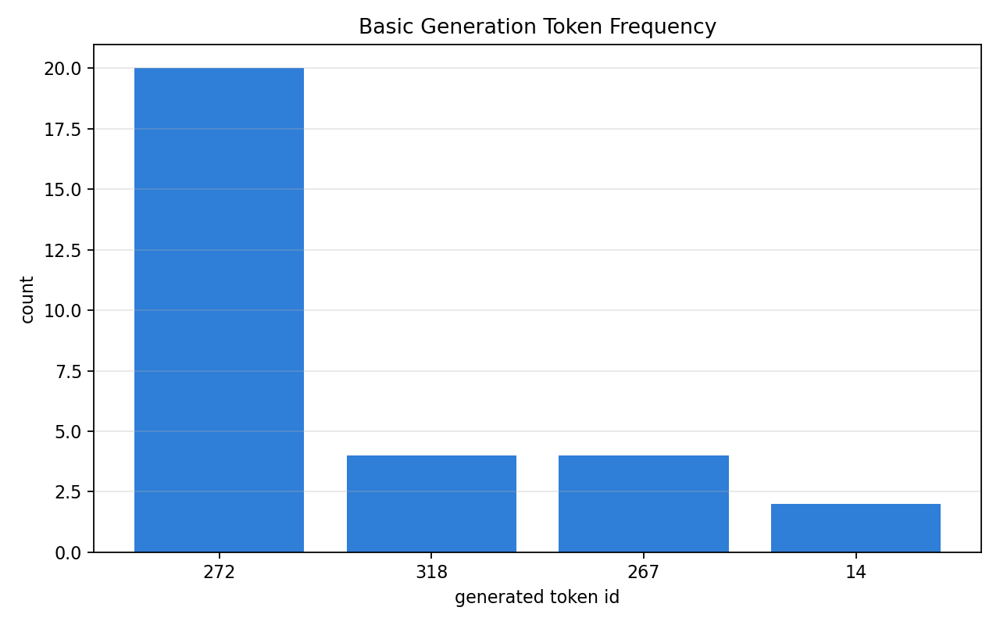

## Basic Checkpoint Save/Load Loss

- 원본 이미지: `figures/basic_checkpoint_loss.png`
- 결과 JSON: `figures/basic_checkpoint_smoke.json`
- 요약: Basic 50-step checkpoint 저장/복원에서 loss가 7.538605로 동일했고 parameter 최대 차이는 0.0이었습니다.

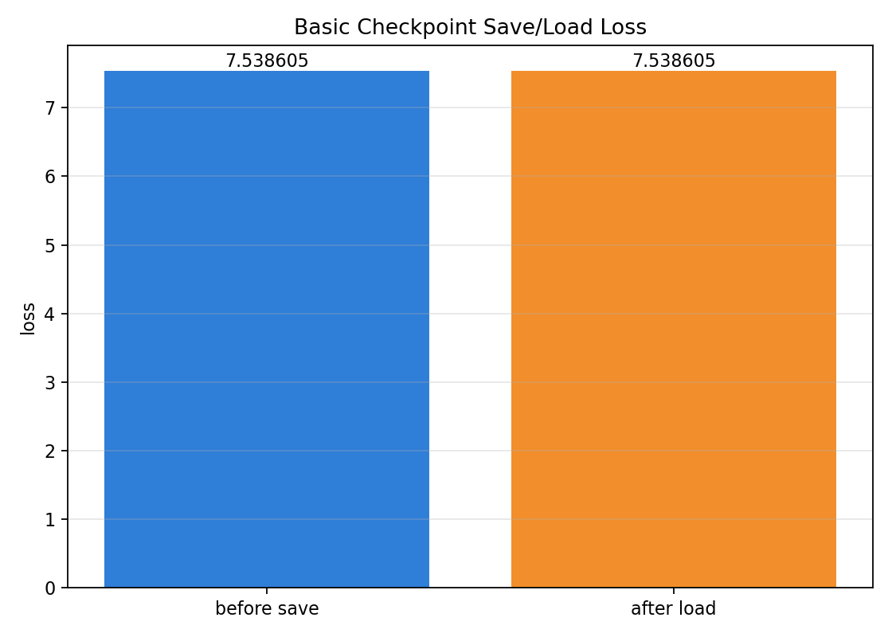

## Basic Token ID Cache Performance

- 원본 이미지: `figures/basic_token_cache_perf.png`
- 결과 JSON: `figures/basic_token_cache_perf.json`
- 요약: 전체 Basic BPE encode는 280.018초였고, token ID cache load는 3회 평균 0.011초였습니다.

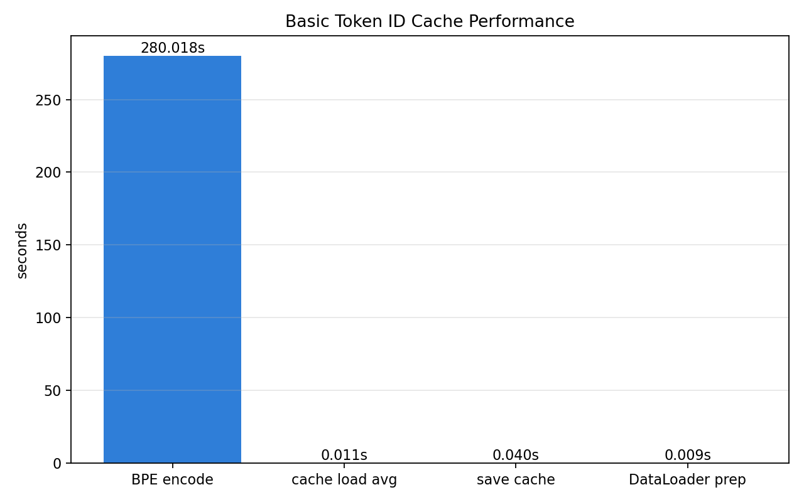

## Cached Basic 100-step Train/Validation Loss

- 원본 이미지: `figures/basic_cached_100step_loss.png`
- 결과 JSON: `figures/basic_cached_100step_loss.json`
- 요약: token ID cache를 사용한 Basic 100-step에서 train loss는 8.1775에서 7.3897로, validation loss는 8.1748에서 7.3425로 감소했습니다.

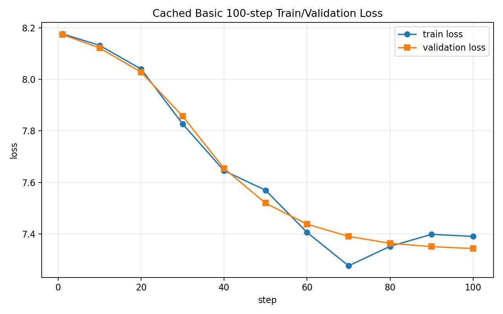

## Cached Basic 100-step Generation Token Frequency

- 원본 이미지: `figures/basic_cached_100step_generation_token_freq.png`
- 결과 JSON: `figures/basic_cached_100step_generation_smoke.json`
- 요약: 100-step 학습 후 greedy generation에서 token id 267 (`이`)가 30회 반복 생성되었습니다.

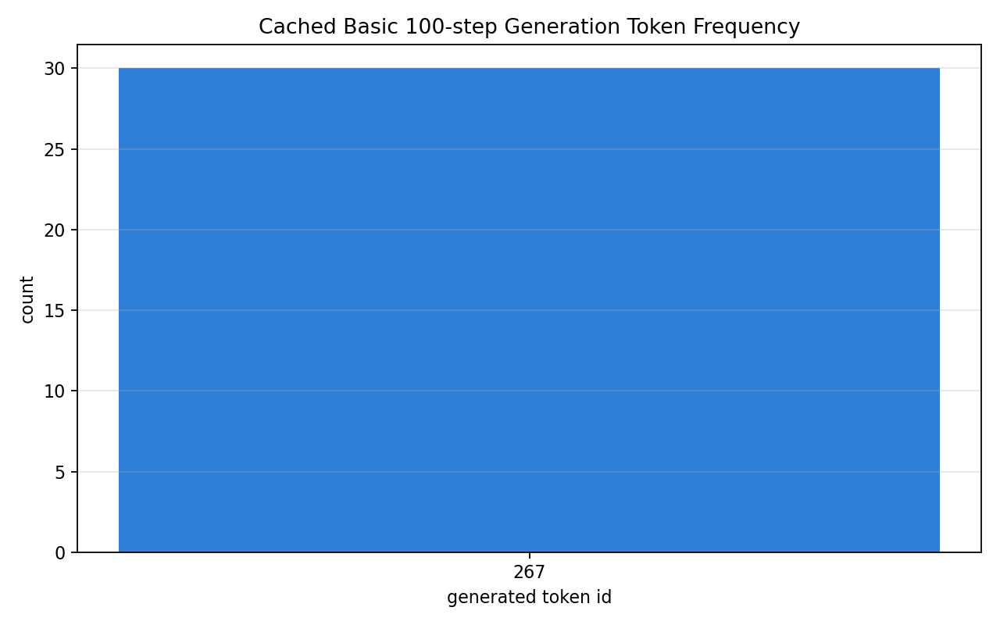

## Cached Basic 100-step Greedy vs Sampling Token Frequency

- 원본 이미지: `figures/basic_cached_100step_sampling_token_freq.png`
- 결과 JSON: `figures/basic_cached_100step_sampling_smoke.json`
- 요약: greedy는 unique token 1개였고, `temperature=0.8`, `top_k=40` sampling은 unique token 19개였습니다.

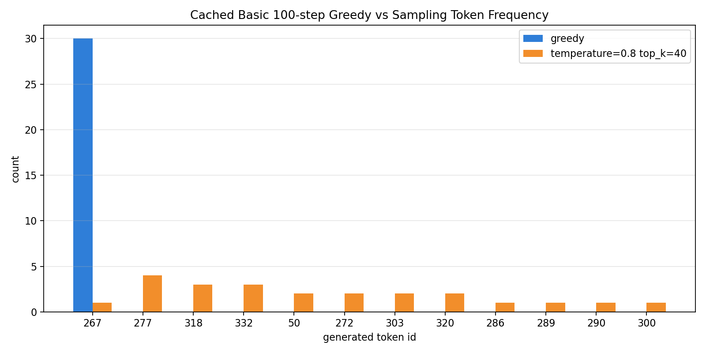

## Basic Checkpoint Resume Consistency

- 원본 이미지: `figures/basic_checkpoint_resume_loss.png`
- 결과 JSON: `figures/basic_checkpoint_resume_smoke.json`
- 요약: 100-step checkpoint를 로드해 120-step까지 이어 학습했고, resume 120-step train loss는 7.2711로 연속 학습 7.2706과 매우 근접했습니다.

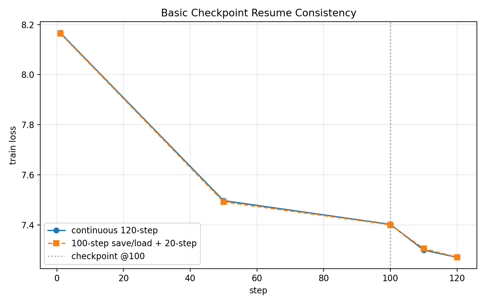

## Finetune Sentiment Classifier Smoke Loss

- 원본 이미지: `figures/finetune_classifier_smoke_loss.png`
- 결과 JSON: `figures/finetune_classifier_smoke.json`
- 요약: 1-step 업데이트 후 batch loss는 0.772232에서 0.657083으로 감소했고 validation accuracy는 0.539062였습니다.

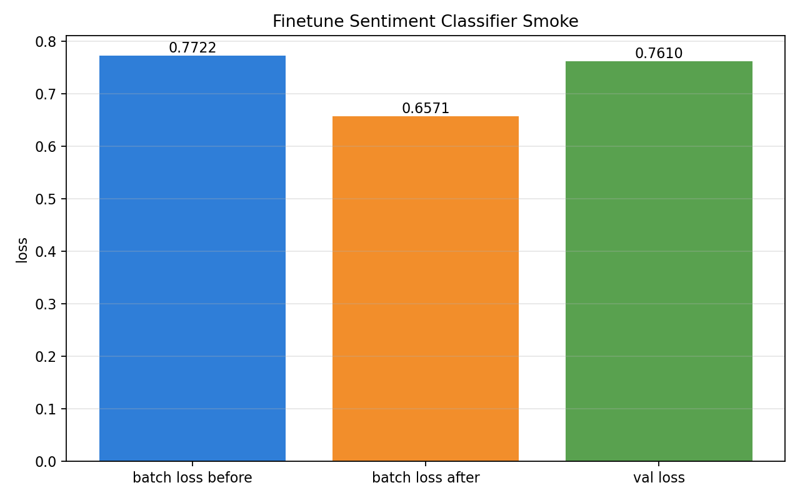

## Finetune Mini Train/Validation Curve

- 원본 이미지: `figures/finetune_mini_curve.png`
- 결과 JSON: `figures/finetune_mini_curve.json`
- 요약: 1,024개 train subset에서 train loss는 0.7590에서 0.6432로 감소했고, validation accuracy는 0.4648에서 0.5117로 변했습니다.

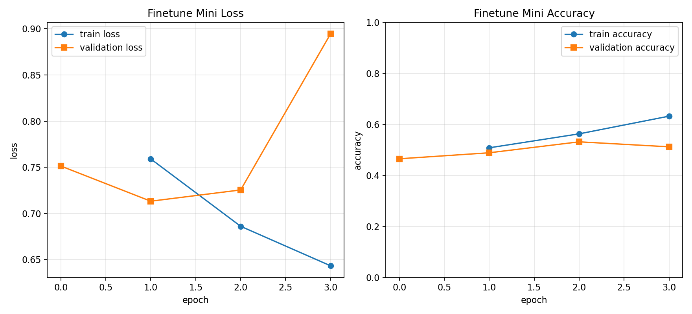

## Finetune Mini Test Confusion Matrix

- 원본 이미지: `figures/finetune_mini_test_confusion.png`
- 결과 JSON: `figures/finetune_mini_test_confusion.json`
- 요약: test subset accuracy는 0.531250이었고, confusion matrix는 `[[4, 117], [3, 132]]`로 positive class 예측 쏠림이 나타났습니다.

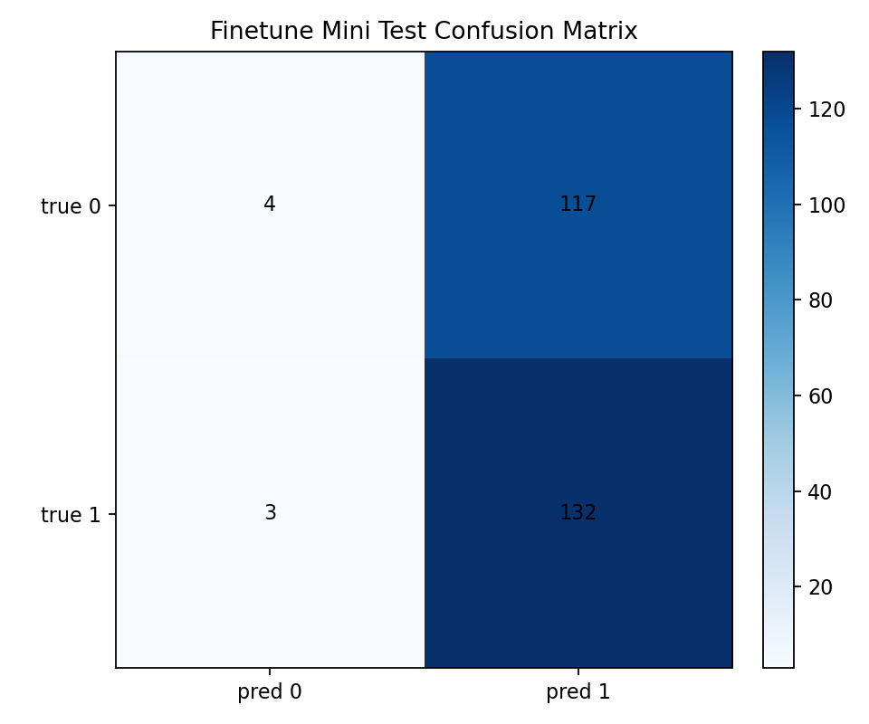
