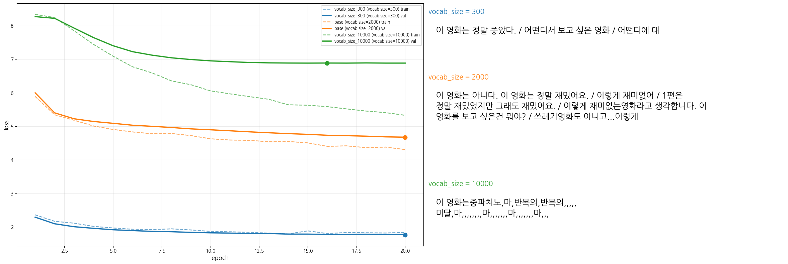
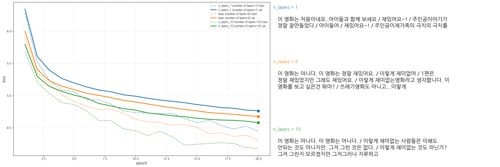
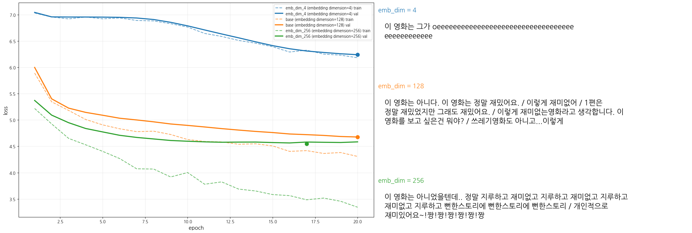
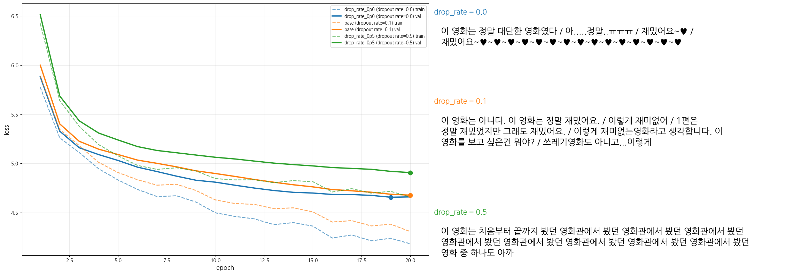
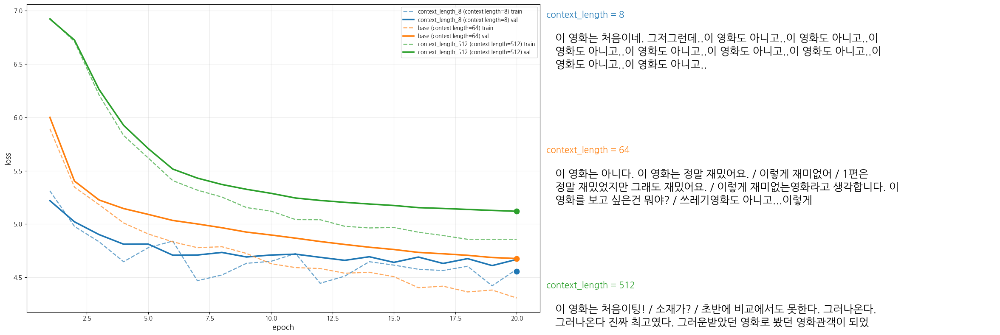
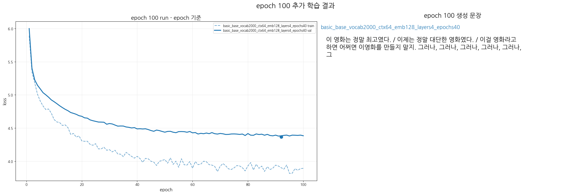

# mini GPT 구현 과제 보고서

## 0. 반·팀원

| 항목 | 내용 |
| --- | --- |
| 반 | 301 - 5조 |
| 팀원 | 고명석, 강지현, 김원우, 김은재 |

---

## 1. 구현 현황

| 단계 | 구현 내용 | 구현 파일 | 담당자 |
| --- | --- | --- | --- |
| 1 | UTF-8 byte-level BPE tokenizer | `src/bpe.py` | 김원우 |
| 2 | GPTDataset, create_dataloader, InputEmbedding | `src/dataset.py`, `src/embeddings.py` | 김원우 |
| 3 | MultiHeadAttention, causal mask | `src/attention.py` | 강지현 |
| 4 | LayerNorm, GELU, FeedForward, TransformerBlock, GPTModel, generate_text_simple | `src/model.py` | 고명석 |
| 5 | loss 계산, checkpoint, generate, train_model | `src/train.py` | 김은재 |
| 6 | NSMC 감성 분류 Dataset과 classifier | `src/finetune.py` | 김은재 |

---

## 2. 테스트 통과 현황

| 실행 명령 | 결과 |
| --- | --- | 
| `pytest tests/test_bpe.py -v` | 통과 |
| `pytest tests/test_dataset.py -v` | 통과 |
| `pytest tests/test_attention.py -v` | 통과 |
| `pytest tests/test_model.py -v` | 통과 |
| `pytest tests/test_train.py -v` | 통과 |
| `pytest tests/test_finetune.py -v` | 통과 |
| `pytest tests/ -v` | 통과 |

---

## 3. 데이터

| 항목 | 내용 |
| --- | --- |
| 원본 데이터 | NSMC |
| 원본 경로 | `data/ratings_train.txt`, `data/ratings_test.txt` |
| 사전 학습 데이터 | `data/nsmc_lm_train.txt`, `data/nsmc_lm_val.txt` |
| 미세 조정 데이터 | `data/nsmc_sentiment_train.jsonl`, `data/nsmc_sentiment_val.jsonl`, `data/nsmc_sentiment_test.jsonl` |
| 전처리 방식 | 빈 리뷰 제거, 공백 정리, 언어 모델 학습용 텍스트와 감성 분류용 JSONL로 분리 |
| 사전 학습 전체 크기 | train 약 1,417,311자, validation 약 123,849자 |
| 실험 사용 크기 | Basic 설정 기준 사전 학습 전체 데이터 사용: train 약 1,417,311자, validation 약 123,849자 |
| 감성 분류 데이터 크기 | train 137,996개, validation 11,999개, test 49,997개 |

---

## 4. BPE

| 항목 | 내용 |
| --- | --- |
| 구현 파일 | `src/bpe.py` |
| BPE 방식 | UTF-8 byte-level BPE |
| 특수 토큰 ID | `<pad>=0`, `<unk>=1`, `<bos>=2`, `<eos>=3` |
| byte token ID 범위 | 4~259 |
| vocab_size | 2,000 |
| 학습 corpus 크기 | Light 설정 기준 `train_corpus[:500_000]` |
| vocabulary 저장 경로 | `/content/drive/MyDrive/mini-gpt-lab/vocabs/nsmc_bpe_light_vocab2000_chars500000.json` |
| 인코딩/디코딩 복원 확인 | `이 영화는 정말 좋았다.` 문장을 encode 후 decode하여 원문 복원 여부 확인 |
| 재사용 방식 | vocab 파일이 이미 있으면 다시 학습하지 않고 load하여 사용 |

---

## 5. 모델 구조

| 항목 | 내용 |
| --- | --- |
| 구현 파일 | `src/model.py` |
| 전체 구조 | InputEmbedding -> N x TransformerBlock -> LayerNorm -> LM head |
| vocab_size | 2,000 |
| context_length | 64 |
| emb_dim | 128 |
| n_heads | 4 |
| n_layers | 4 |
| drop_rate | 0.1 |
| qkv_bias | False |
| 총 파라미터 수 | base 설정 기준 1,312,000개. 아래 계산식 참고 |

### 5.1 총 파라미터 수 계산

base 설정은 `vocab_size=2,000`, `context_length=64`, `emb_dim=128`, `n_layers=4`, `qkv_bias=False`이다.

| 구성 요소 | 계산식 | 파라미터 수 |
| --- | --- | ---: |
| token embedding | `vocab_size * emb_dim = 2,000 * 128` | 256,000 |
| position embedding | `context_length * emb_dim = 64 * 128` | 8,192 |
| embedding 합계 | `256,000 + 8,192` | 264,192 |
| attention Q/K/V projection | `3 * (emb_dim * emb_dim) = 3 * (128 * 128)` | 49,152 |
| attention output projection | `(emb_dim * emb_dim) + emb_dim = (128 * 128) + 128` | 16,512 |
| attention 합계 | `49,152 + 16,512` | 65,664 |
| block LayerNorm 2개 | `2 * (gamma 128 + beta 128)` | 512 |
| FeedForward 1번째 Linear | `(128 * 512) + 512` | 66,048 |
| FeedForward 2번째 Linear | `(512 * 128) + 128` | 65,664 |
| FeedForward 합계 | `66,048 + 65,664` | 131,712 |
| TransformerBlock 1개 | `LayerNorm 512 + Attention 65,664 + FeedForward 131,712` | 197,888 |
| TransformerBlock 4개 | `197,888 * 4` | 791,552 |
| final LayerNorm | `gamma 128 + beta 128` | 256 |
| LM head | `emb_dim * vocab_size = 128 * 2,000` | 256,000 |

최종 총 파라미터 수는 다음과 같다.

`embedding 264,192 + TransformerBlock 791,552 + final LayerNorm 256 + LM head 256,000 = 1,312,000`

---

## 6. 사전 학습

### 6.1 하이퍼파라미터

| 구분 | 항목 | 값 |
| --- | --- | --- |
| 모델 | vocab_size | 2,000 |
| 모델 | context_length | 64 |
| 모델 | emb_dim | 128 |
| 모델 | n_heads | 4 |
| 모델 | n_layers | 4 |
| 학습 | batch_size | 8 |
| 학습 | num_epochs | 20 |
| 학습 | eval_freq, eval_iter | 100, 10 |
| 학습 | ckpt_freq | 100 |
| 최적화 | lr, weight_decay | 3e-4, 0.1 |
| 실험 모드 | SWEEP_MODE | Basic |
| seed | SEED | 123 |

### 6.2 하이퍼파라미터 실험 계획

한 번에 하나의 하이퍼파라미터만 변경하여 결과를 비교했다. base 설정을 기준으로 아래 값들을 각각 small / base / large 역할로 사용했다.

| 변경 항목 | 비교 값 |
| --- | --- |
| learning_rate | 3e-4 |
| batch_size | 8 |
| drop_rate | 0.0, 0.1, 0.5 |
| context_length | 8, 64, 512 |
| emb_dim | 4, 128, 256 |
| n_heads | 4 |
| n_layers | 1, 4, 10 |
| epoch | 20 |

### 6.3 결과 확인 방식

| 항목 | 내용 |
| --- | --- |
| 실행 위치 | `gpt-lab.ipynb`의 Colab 학습 실행 셀 |
| 기록 파일 | `config.json`, `metrics.jsonl`, `summary.json`, `DONE.json`, `samples.jsonl` |
| 손실 그래프 |  |
| 과적합 확인 | `val_loss - train_loss` 그래프 |
| 추가 지표 | validation perplexity, tokens/sec |
| 생성 샘플 시작 문맥 | `이 영화는` |

---

## 7. 미세 조정 - 테스트 미진행

| 항목 | 내용 |
| --- | --- |
| 구현 파일 | `src/finetune.py` |
| 과제 | NSMC 리뷰 긍정/부정 분류 |
| 데이터 포맷 | JSONL, `text`, `label` |
| max_length | (예: 128) |
| batch_size | (예: 16) |
| backbone learning rate |  |
| classifier learning rate |  |
| validation loss / accuracy |  |
| test loss / accuracy |  |
| 오류 예시 | 틀린 리뷰 예시와 추정 원인 |

---

## 8. 실험 환경

| 항목 | 내용 |
| --- | --- |
| Python | 로컬: Python 3.14.2, Colab: 런타임 Python |
| PyTorch | `torch>=2.0.0` |
| 주요 라이브러리 | `numpy>=1.24`, `matplotlib>=3.7`, `pytest>=7.0` |
| 실행 환경 | Colab 학습 실행 |
| 저장 위치 | Google Drive `/content/drive/MyDrive/mini-gpt-lab` |
| GPU/CPU 정보 | Colab 런타임에서 T4 GPU로 진행 |
| 총 학습 소요 시간 | 각 run의 metrics / DONE 파일에서 확인 |

loaded runs: 12
- base | best val loss: 4.6755
- basic_base_vocab2000_ctx64_emb128_layers4_epochs40 | best val loss: 4.3679
- context_length_512 | best val loss: 5.1198
- context_length_8 | best val loss: 4.5576
- drop_rate_0p0 | best val loss: 4.6563
- drop_rate_0p5 | best val loss: 4.9072
- emb_dim_256 | best val loss: 4.5493
- emb_dim_4 | best val loss: 6.2411
- n_layers_1 | best val loss: 4.7601
- n_layers_10 | best val loss: 4.5776
- vocab_size_10000 | best val loss: 6.8866
- vocab_size_300 | best val loss: 1.7638

### 1. vocab_size 비교

 
 
 
 

### 2. Transformer layer 수 비교

 
 
 
 

### 3. embedding dimension 비교

 
 
 
 

### 4. dropout rate 비교

 
 
 
 

### 5. context length 비교

 
 
 
 

### 6. basic base 모델 결과

---

## 9. 고찰

- 한국어는 한 글자가 여러 UTF-8 byte로 표현되므로 byte를 하나씩 문자로 decode하면 깨질 수 있다. 따라서 merge token을 원본 byte까지 펼친 뒤 마지막에 한 번만 UTF-8 decode하도록 구현했다.
- BPE vocab은 실험 간 공정한 비교를 위해 공통으로 사용했다. vocab까지 바꾸면 모델 성능 차이가 토크나이저 차이 때문인지 모델 설정 차이 때문인지 구분하기 어렵기 때문이다.
- 사전 학습은 한 번에 하나의 하이퍼파라미터만 바꾸는 방식으로 진행했다. 이 방식은 실험 수는 늘어나지만 어떤 설정이 loss와 속도에 영향을 주는지 해석하기 쉽다.
- validation loss, perplexity, overfitting gap을 함께 확인하도록 그래프를 구성했다. 단순히 train loss만 보면 모델이 훈련 데이터를 외우는지 일반화되는지 판단하기 어렵다.
- fine-tuning은 사전 학습된 `best.pt`를 불러와 classifier head를 붙이는 방식으로 진행했다. 이를 통해 사전 학습 설정이 감성 분류 성능에 어떤 영향을 주는지 비교할 수 있다.
- 개선할 점은 실험 결과가 쌓인 뒤 가장 좋은 사전 학습 설정을 기준으로 fine-tuning learning rate, freeze 여부, epoch 수를 추가로 비교하는 것이다.
